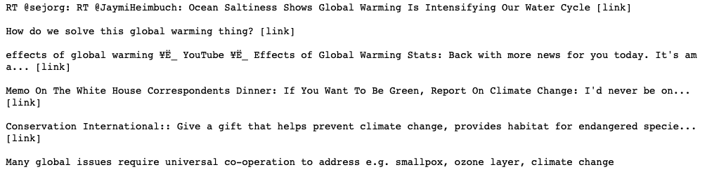

# Text Classification

## Sentiment Analysis on Global Warming

<p>Understand emotions, identify opinions and attitudes towards climate change/global warming through twitter posts and classify viewpoints as positive, negative or neutral.</p>

<p>The data set for this project is sourced from Figure Eight platform and the name of the set is Sentiment Analysis on Global Warming/Climate Change. The set contains three classifications: Yes if the tweet suggests global warming existence, No if the tweet is in disagreement, and neutral if the tweet is not engaged on either side. A column with the confidence score for the classification of each tweet is included in the set with a total of 6090 rows.</p>


### Process

* The whole dataset will be cleaned and prepared, after this process I will make the split into train and test data.
* Lowercase all text
* Remove stop words, punctuation and special characters
* Tokenize data: split a string of text into individual tokens (words)
* Remove suffixes using stemming technique

##### Tweet before processing



##### Tweet after processing


### Models Overview

#### RNN - LSTM


#### RNN - GRU


#### CNN


### Summary

* RNN with LSTM loss: 0.3046527626316604, acc: 0.9239079379990606
* RNN with GRU loss:0.29606976192322076, acc: 0.9253170502583372
* CNN loss: 0.32124241268565856, acc: 0.92555190230155
* The accuracies of each model are very close but the recurrent neural network  with GRU cells gives a less loss with an accuracy very close to a CNN.


```python

```
